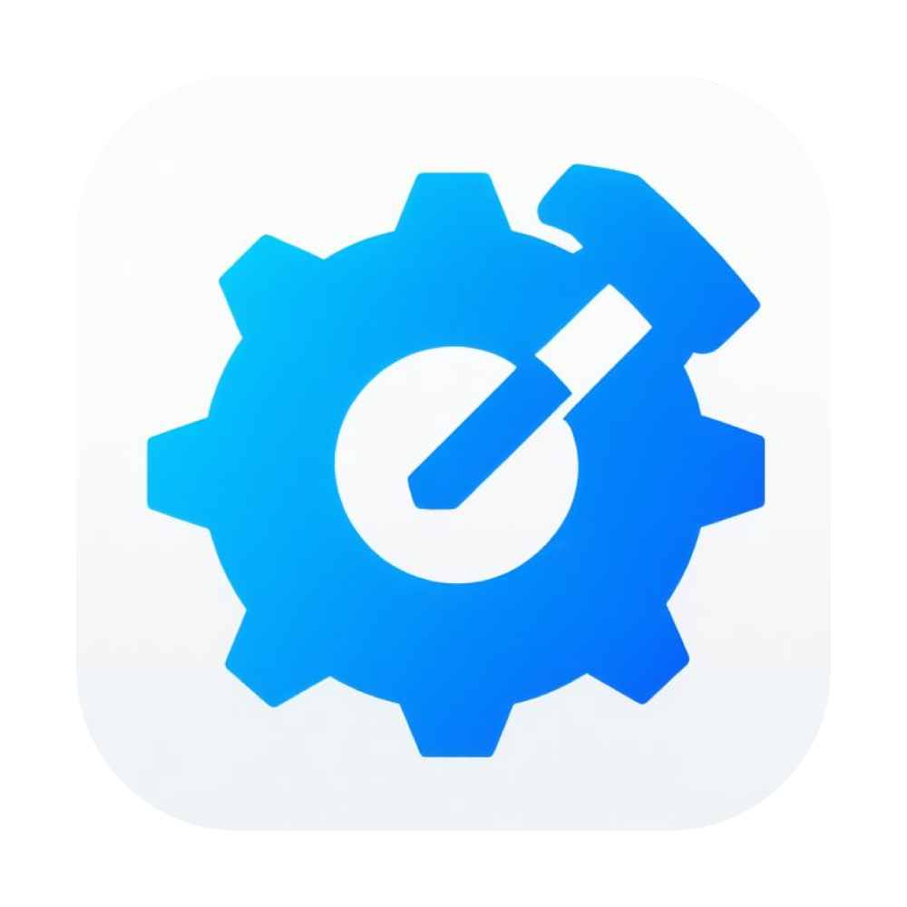
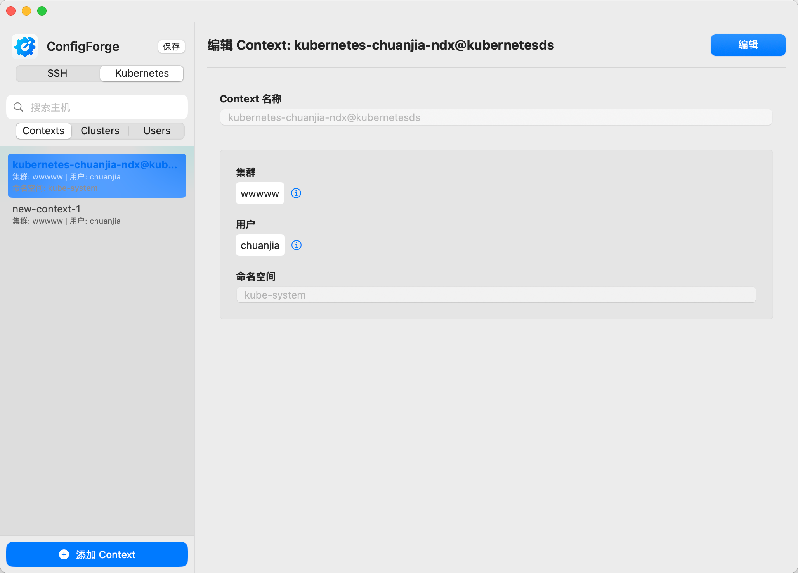

# ConfigForge

<p align="center">
  
</p>

<p align="center">
  <b>A simple and efficient SSH and Kuberenetes tool</b>
</p>

<p align="center">
  
  
  
  <a href="https://deepwiki.com/samzong/ConfigForge"></a>
</p>

## Introduction

ConfigForge is an open-source configuration management tool for macOS users,
supporting visual management of SSH and Kubernetes configurations.
It provides a simple UI to manage the '~/.ssh/config' and '~/.kube/config' files,

allowing you to easily to manage various configurations,
avoiding the cumbersome and error risks of directly editing text files.

### Screenshot

<p align="center">
  
</p>

As a completely open-source project, ConfigForge respects users' privacy and freedom.
All code is transparent and publicly available, ensuring that your configuration is safe and reliable.

### Demo for cf command

<p align="center">
  <a href="https://asciinema.org/a/719497" target="_blank"></a>
</p>

## Features

- 🖥️ Intuitive GUI for managing SSH hosts and KubeConfig files.
- ⚡️ Command-line tool cf for quick host connection and config switching.
- 🔒 SSH host management supports multiple hosts and auto-detects entries in .ssh/config.
- ☁️ Manage multiple KubeConfig files separately in .kube/configs without merging clusters.

## Installation

Recommend using Homebrew to install and update; `cf` command will be added to your PATH automatically.

```bash
brew tap samzong/tap
brew install configforge
```

If you still can't open the app, run this command in Terminal:

```bash
xattr -dr com.apple.quarantine /Applications/ConfigForge.app
```

## License

This project is licensed under the MIT License - see the [LICENSE](LICENSE) file for details.

## Acknowledgments

- Thanks to all open source project contributors
- [Swift](https://swift.org/) and [SwiftUI](https://developer.apple.com/xcode/swiftui/) teams
- [Swift Argument Parser](https://github.com/apple/swift-argument-parser) for CLI development
- All users who provided feedback and suggestions
